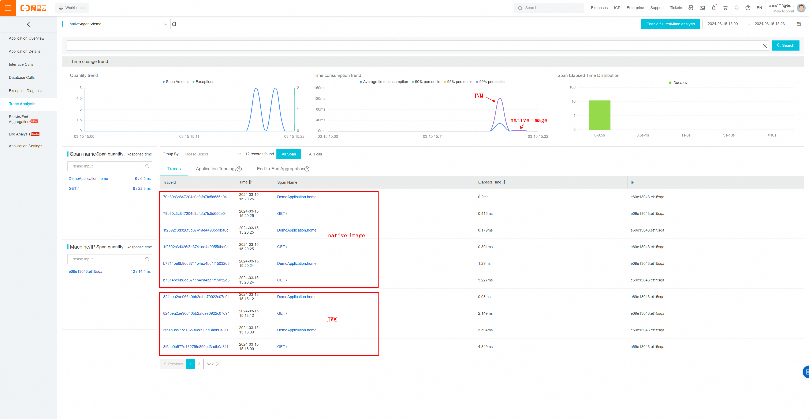

# Getting Started
This project demonstrates the agent support ability of GraalVM native image enforced by the [agent support PR](https://github.com/oracle/graal/pull/8077).

The base project is the [Spring native demo project](https://start.spring.io/#!type=maven-project&language=java&platformVersion=3.2.1&packaging=jar&jvmVersion=17&groupId=com.example&artifactId=demo&name=demo&description=Demo%20project%20for%20Spring%20Boot&packageName=com.example.demo&dependencies=native).

When gets started, it responds "Hello World!" to a request to localhost:2327.
This project starts along with OpenTelemetry java agent instrumentation as described here: https://opentelemetry.io/docs/instrumentation/java/getting-started/#instrumentation. The monitoring data can be collected by log or other supported means. 
## Methodology
To support agent instrumentation in native image, actions should be taken from two sides:
1. GraalVM side: must support compiling the instrumented code into the native image. It is supported by the [agent support PR](https://github.com/oracle/graal/pull/8077).
2. Agent side: agent developer must define agent's behaviors in native image. Such as the `premain` behaviors and JDK class transformations. [Opentelemetry-agent-native project](../opentelemetry-agent-native/) gives an example of how such adaption is done for OpenTelemetry agent.  

## Run Native Image with Agent Instrumentation
### Prequisite

 - Build the `agent support PR` to get the GraalVM JDK.
 - Or download the [dev version [binary](https://github.com/ziyilin/ziyi-forked-graal/releases/tag/static-instrument) for the experiment only.
 - Make sure your `GRAALVM_HOME` system variable refers to one of the above GraalVM releases.

### Steps
1. cd to the root of this project
2. `mvn package`: Build the jar package of this project
3. `./run.sh --jvm --collect --log`: Execute the project in JVM mode, enabling OpenTelemetry agent to log monitoring data. Meanwhile, native-image-agent is enabled to collect transformation classes and other dynamic data. When this step ends, data is dumped to `native-configs` directory.
4. `./build.sh`: Build the native image.
5. `./run.sh --svm --log`: Run the native image application. 
6. `curl localhost:2327`: Send a request to the application.
   
### Alternatives
In the above steps, the OT agent prints monitoring data in the console. In the more practical scenarios, the data is collected and sent to the monitoring platform such as ARMS (Application Real-Time Monitoring Service) from Alibaba Cloud.

This demo project supports such a scenario as well:
1. Set your system variables `ARMS_AUTH` and `ARMS_ENDPOINT`. `ARMS_AUTH` is your token, it looks like `b590lhguqs@3a7*********9b_b590lhguqs@53d*****8301`. `ARMS_ENDPOINT` is your connection endpoint, it looks like `http://tracing-analysis-dc-bj.aliyuncs.com:8090`. These two values can be obtained from your control panel if you're already a customer of ARMS. The service name by default is "native-agent-demo". It can be modified by editing the `run.sh` script.
2. For the above step 3 and 5, replace `--log` with `--arms`. 

The following diagram illustrates the result shown in the ARMS platform.
