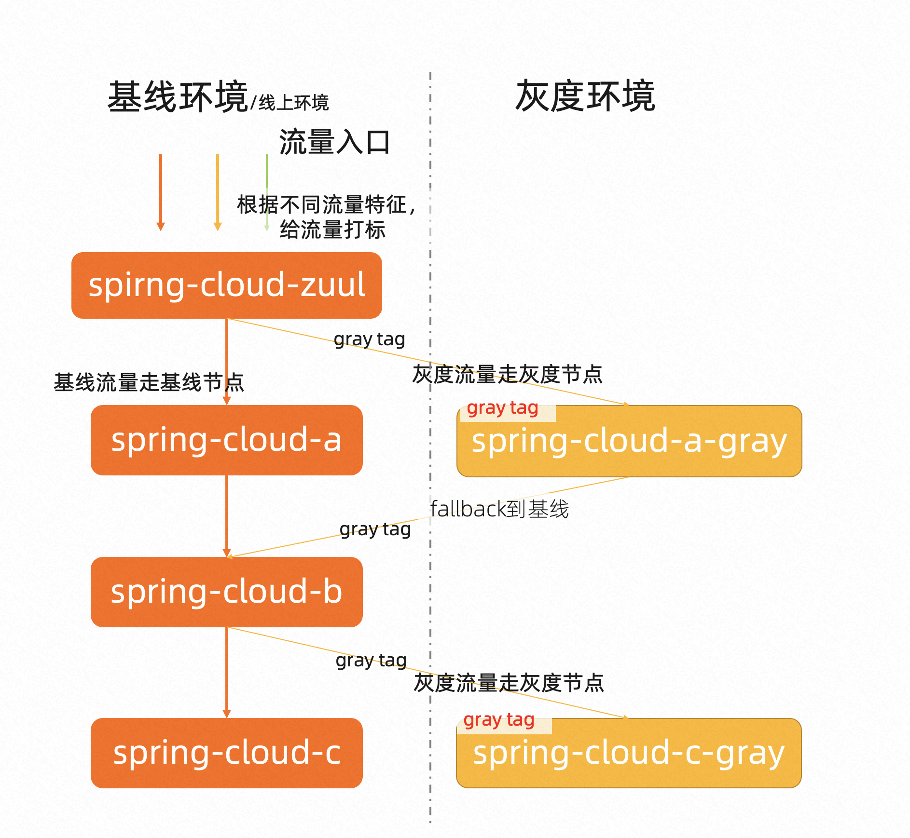

# mse-simple-demo

mse-simple-demo是一个简单的微服务demo，架构如下：



# 如何部署

```sh
helm3 upgrade mse-simple-demo1 \
  helm/mse-simple-demo \
  --install \
  --set registry=registry.cn-shanghai.aliyuncs.com/yizhan/ \
  --set mse.namespace=mse-test
```

* `registry`: 容器镜像地址前缀（可选）
* `mse.namespace`: 接入MSE微服务治理的微服务命名空间，可以用来区分环境
